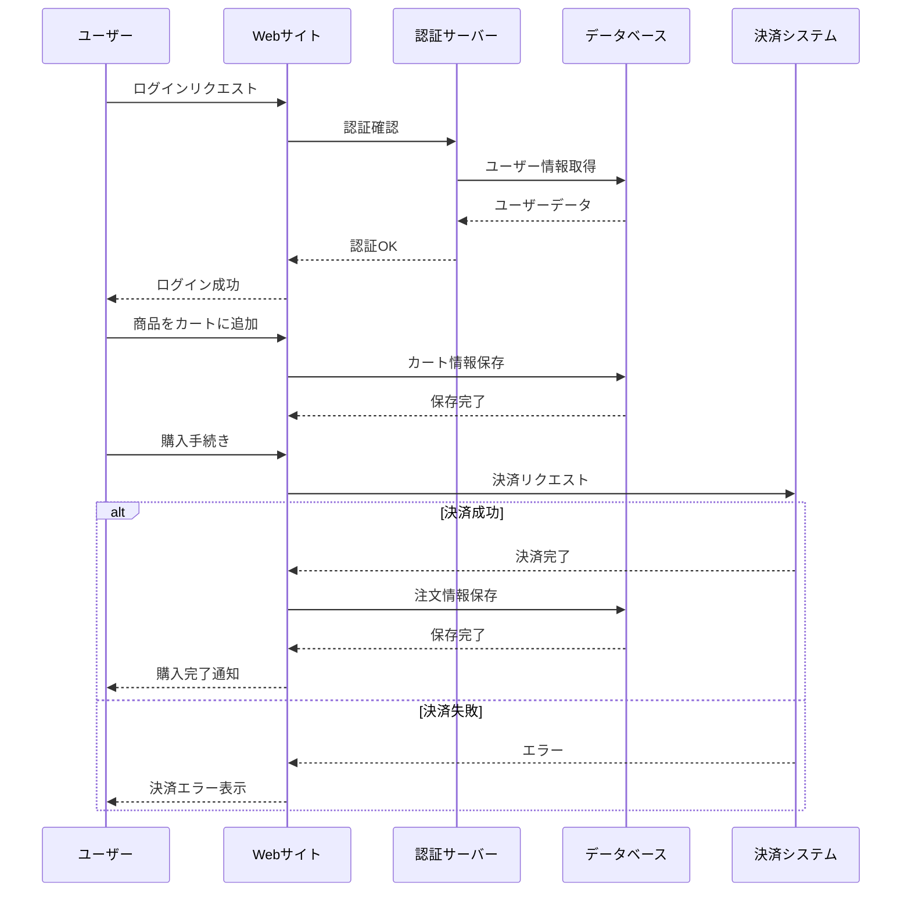

# 国際化対応

## ユースケース
### 商品名称登録
#### 画面遷移
1. [商品一覧画面](./components/product-list.md)を開く

#### シーケンス

```mermaid
sequenceDiagram
    participant U as ユーザー
    participant W as Webサイト
    participant A as 認証サーバー
    participant D as データベース
    participant P as 決済システム

    U->>W: ログインリクエスト
    W->>A: 認証確認
    A->>D: ユーザー情報取得
    D-->>A: ユーザーデータ
    A-->>W: 認証OK
    W-->>U: ログイン成功

    U->>W: 商品をカートに追加
    W->>D: カート情報保存
    D-->>W: 保存完了

    U->>W: 購入手続き
    W->>P: 決済リクエスト

    alt 決済成功
        P-->>W: 決済完了
        W->>D: 注文情報保存
        D-->>W: 保存完了
        W-->>U: 購入完了通知
    else 決済失敗
        P-->>W: エラー
        W-->>U: 決済エラー表示
    end
```
